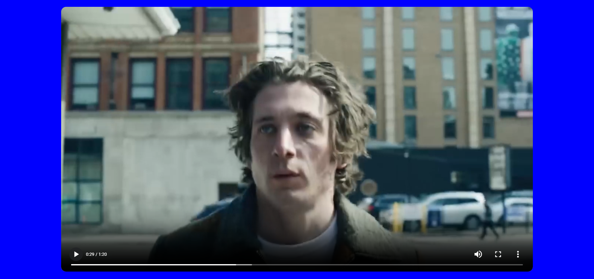

# HCD

In webontwikkeling streven we ernaar om producten te maken die voor iedereen bruikbaar zijn. Maar voordat we dat kunnen doen, moeten we goed begrijpen wie 'iedereen' eigenlijk is. Dus beginnen we met het leren kennen van alle verschillende soorten mensen die onze producten zouden kunnen gebruiken.

## Opdracht

Voor dit vak zijn drie mensen uitgenodigd die elke week langs komen. Iedereen krijgt een persoon aangewezen om voor te ontwerpen. Deze mensen gebruiken het web op hun eigen manier, door hun beperkingen. De opdracht is dus een prototype maken dat de wensen van deze persoon vervult.

Mijn aangewezen persoon is Marie van Driessche. Zij is doof maar kijkt toch graag naar films en series en wilt naar podcasts kunnen luisteren. Aan mij de taak om iets te bedenken dat hierbij helpt.

## Week 1 - Introductie en kennismaking

Deze week kregen we een introductie van het vak en een indeling van wie welke persoon aangewezen krijgt. Daarna volgde er momenten om deze persoon (Marie) te interviewen. We moesten dus vragen voorbereiden. Samen met de groep die ook Marie hadden hebben we deze vragen bedacht:

- Waar komt de interesse in podcasts vandaan ?
- Welke podcast(s) zou je willen luisteren/kijken ?
- Tegen welke problemen loop je aan bij de closed captions van podcasts en films ?
- Heb je zelf misschien suggesties om de ervaring te verbeteren ?
- Wat kijk je vooral ?
- hoe en waar kijk je films ?
- wat maakt iets spannend voor jou ?
- Welke goede ervaringen heb je bij films of series ?

Tijdens het interview viel het mij op dat Marie (via een doventolk) erg veel praat voor iemand die niet kan praten. Ze heeft ons erg veel inzichten gegeven die kunnen helpen bij het creëren van ideeën. Dit zijn de belangrijke bevindingen die ik uit het interview gehaald heb:

- zou mooi zijn als de ondertiteling de verschillende personen zou weergeven in hoe zij overkomen. Ik krijg vaak niet mee hoe een character spreekt.

- Ondertiteling is erg plat. Geluid niet. Een zin kan hard beginnen en zacht eindigen. Toon kan veranderen binnen een zin. Gebaren en gesproken taal hebben andere lading dan tekst.

- The Dodo. Maakt heel goed de geluiden zichtbaar in de videos. Kan een goed voorbeeld zijn.

- goed voorbeeld uit the bear. Veel door elkaar gepraat maar niet te zien in de ondertiteling. miste dus hele stukken. daar is het ook goed om te kijken om de cc uit te breiden om alle stemmen te weergeven.

- Dune heeft goede cc. the lord of the rings ook. Muziek heb ik wel gemist in deze film. Vooral graag de sfeer en de stijl van de sprekers meekrijgen.

Mijn conclusie is dan dat het belangrijkst is (en waar cc nu vaak in tekort komt) dat de emotie van de film of serie wordt overgebrackt. Dit gebeurt vaak in de vorm van muziek of geluid, of hoe iemand een bepaalde zijn uitspreekt. Dit zie je niet terug in de ondertiteling. Soms heb je in cc dat er staat _sad music_ maar als je niet weet hoe droevige muziek klinkt heb je daar helemaal niets aan.

Het doel dat ik ga proberen te behalen is dus het gevoel van de film of serie overbrengen zonder geluid.
Ik heb al een paar ideeën:

- Een visuele manier om de muziek te laten zien. Een beetje het idee van de oude windows media player.

- het scherm doormiddel van lijnen en positie van ondertiteling te laten zien waar het vandaan komt en hoe het wordt uitgesproken.

 

In dit voorbeeld zie je "Marcus" achterin aan komt lopen. Hij roept "BEHIND!" zodat zijn collegas kunnen horen dat hij achterlangs loopt en ze niet naar achteren stappen. Zoals te zien is het in caps uitgeschreven met een uitroepteken om te laten zien hoe hard het wordt uitgesproken. "Richie" vraagt daarintegen zacht "what?" aan "Camry".

## Week 2 - Prototypen en testen

Tijdens het maken van het prototype ben ik verder gegaan met het idee van kleuren om de muziek visueler te maken. Ik kwam dit [artikel](https://www.linkedin.com/pulse/psychology-color-how-use-evoke-emotion-tacpoint/) tegen dat ingaat op de emoties die bepaalde kleuren bij mensen opbrengt:

- Red: passion, love, excitement, anger, danger
- Orange: joy, enthusiasm, creativity, warmth
- Yellow: happiness, optimism, hope, energy
- Green: nature, peace, calmness, growth
- Blue: trust, loyalty, intelligence, sadness
- Purple: luxury, mystery, creativity, wisdom
- Pink: love, romance, femininity, gentleness
- Black: sophistication, elegance, mystery, death
- White: purity, innocence, cleanliness, simplicity

Op basis van deze kleuren wil ik de achtergrond van de videospeler aanpassan naar de kleur die op dat moment past bij de muziek die afspeelt. Ik heb gekozen voor wit wanneer geen muziek wordt afgespeeld.
In de trailer van The Bear wordt in korte tijd veel gedaan met muziek en daarmee wordt de toon gezet van dat moment. Ik vind dit een goede manier om dit idee uit te werken. Ik heb de video gedownload en in een eigen html pagina gezet, een basic styling toegevoegd en een javascript code geschreven die wanneer ik wil de achtergrond kan aanpassen. Ik heb daarna aan de hand van de muziek in de video de tijden van het aanpassen van de achtergrondkleur erin gezet.

## Week 3 - Prototypen, testen en feedback

Dit is een voorbeeld van het eerste prototype die ik wil gaan testen. Het eerste gedeelte van de trailer is erg druk qua muziek, daarom de kleur rood. Later wordt de muziek wat verdrietiger, dan verandered de achtergrond naar blauw.

### Test Marie
De test verliep goed. Ik heb laten zien wat ik heb. Marie vond de kleuren nog te onduidelijk om een weergave te geven van de sfeer van de muziek. Een goede optie zou kunnen zijn om animaties toe te voegen. Rood zou bijvoorbeeld kunnen knipperen om de drukte en stress weer te geven. Hier kan ik goed mee verder. Ook heb ik de kans gehad om bij mijn medestudenten te kijken wat zij hebben bedacht en wat daar de reactie van Marie op was. Daar heb ik een aantal punten van opgeschreven:

- Voor de captions zoveel mogelijk geluiden laten zien en hoe ze klinken. *Deur opent* is niet goed. Wat voor geluid maakt een deur die opent?
- Sommige geluiden kan je goed met symbolen weergeven. Een goed voorbeeld was een vlieg door het beeld bij het geluid van een vlieg.
- Als je in beeld iets ziet gebeuren hoef je het geluid niet te laten zien.

### Feedback gesprek Eric

Tijdens het feedback gesprek met Eric hebben we besproken hoe we ervoor staan en wat er van ons verwacht wordt. Er wordt vooral naar de design principles gekeken:

- study situation. Goed onderzoek gedaan naar de situatie van je gebruiker. Marie kan bijvoorbeeld makkelijk series kijken in een plek met veel geluid.
- ignore conventions. Negeer bekende oplossingen. Ze willen graag zien dat je met andere oplossingen komt dan de bekende.
- prioritise identity. Het prototype is gemaakt met de identiteit van de gebruiker in gedachte. De tests zijn hier heel bruikbaar voor.
- add nonsense. Probeer dingen toe te voegen die normaal gesproken erg ongebruikelijk zijn. Zo kan je deze ideeen testen en uitvinden of het misschien toch bruikbaar is.

Ook gaf Eric aan dat het beter was om mij te focussen op alleen de muziek. Aangezien dit een lastig gedeelte is van het verbeteren van de ervaring van Marie. Ik ga mij dus alleen focussen op de muziek zichtbaar maken.

## Week 4 - Prototypen, testen, feedback en eindbeoordeling

Ik heb besloten door mijn gesprek met Eric vorige week mijn alleen te focussen op de muziek. Omdat dit een lastig probleem is om op te lossen voor Marie. Daarom zoek ik hier ook de uitdaging in. Wel heb ik captions toegevoegd omdat die ook belangrijk zijn om de context van de muziek te begrijpen. Ik heb dit gedaan met de tool [VEED.IO](https://www.veed.io/). Die voegt automatisch ondertiteling toe en laat je achteraf ook nog de tekst en timing aanpassen. Ook vond ik het animatie effect goed werken. Je ziet de woorden op het scherm schieten wanneer die uitgesproken worden.

Het idee voor de muziek is dus met kleuren aangeven wat de toon van de muziek is. Marie vond dat nog te onduidelijk. "Ik zie rood, maar weet niet wat dit precies betekent, er is meer dan alleen kleur nodig om bij mij een emotie op te roepen." Ik ga dus op zoek naar wat ik kan laten zien om de toon te zetten van de muziek, bovenop de kleur. Rood zou bijvoorbeeld kunnen trillen en bewegen om de drukte uit te beelden. Bij blauw wist ik even niet wat er mogelijk was totdat ik dacht aan regen over het scherm. Regen heeft altijd een beetje een droevig gezicht. Toen bedacht ik me dat rood dan ook donder en bliksem zou kunnen zijn, geel bewolkt maar zonnig en oranje volle zon. De emotie uitdrukken in weer dus.

Het was erg lastig om de juiste content te vinden maar ik heb nu een prototype dat ik graag wil testen met Marie. Ik heb voor het eerste gedeelte bliksemschichten gevonden die erg goed passen bij de drukke muziek. Daarna regen die meer past bij de droevige muziek. Daarna zonnestralen die de hoop en blijheid moeten uitstralen.

